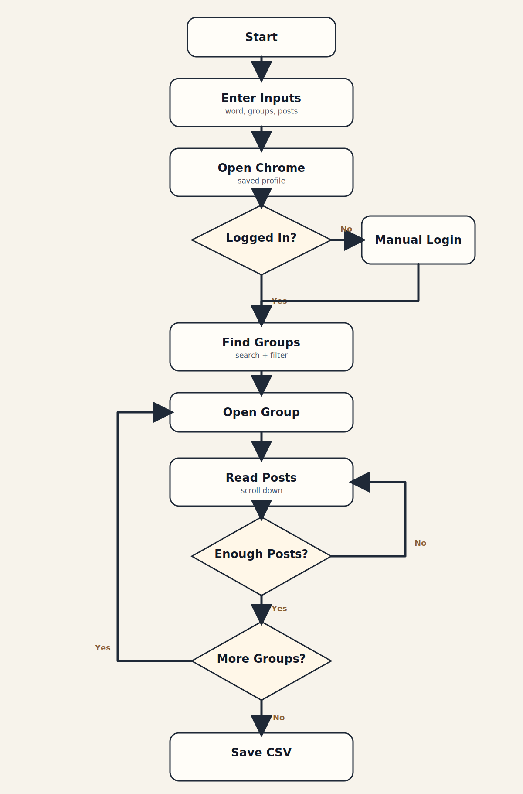

# Facebook Data Extractor

Web-based Facebook groups scraper that opens Chrome, searches groups, extracts posts, and exports CSV.

## System Flow



## What This Project Does

- Searches Facebook groups by your search phrase
- Enables `Public groups` filter before collecting links
- Collects posts from groups and writes CSV rows with:
  - `Author`
  - `Post Time`
  - `Content`
  - `Post Link`
- Provides a modern web UI to run, stop, monitor progress, and download CSV

## Who Needs Installation?

- **End users (people you send the link to):** no installation needed.
- **Only the host machine (your PC/server):** needs Python, Chrome, and project setup.

## Host Requirements

- Windows
- Python 3.10+ (recommended: 3.12)
- Google Chrome installed
- Internet connection
- A Facebook account available on the machine running the scraper

## Host Installation

```powershell
python -m venv .venv
.\.venv\Scripts\Activate.ps1
pip install -r requirements.txt
```

## Run on Host Machine (Web App - Recommended)

```powershell
python app.py
```

Open:

```text
http://localhost:5000
```

If you expose this app with ngrok, users open the ngrok URL in their browser and use it directly.
They do **not** install Python, ChromeDriver, or this repository.

### Web UI Features

- `Run` starts a new scraping job
- `Stop` stops your own current job
- `Process Timeline` shows user-friendly progress logs
- `Download CSV` becomes active when run is complete
- `Clear` clears timeline logs for your job

### Queue Behavior (Important)

- Only **one** scraping run can execute at a time on one machine (one Chrome automation session).
- If another user starts while a run is active, the new run is queued.
- Each browser gets its own `client_id`, and users can control only their own jobs.
- The project now supports storing queue and job state in `Redis` when configured.

### Optional Redis Integration

If you want queue and job state to persist outside the Flask process, configure:

1. Start Redis:

```powershell
docker compose up -d redis
```

2. Set environment variables and run the app:

```powershell
$env:REDIS_URL="redis://localhost:6379/0"
$env:REDIS_PREFIX="facebook_scraper"
python app.py
```

If `REDIS_URL` is not set, the app falls back to the previous in-memory behavior.

## Run (Desktop/CLI Fallback)

```powershell
python main.py
```

If UI is unavailable, the script falls back to terminal prompts.

## Build Client Package (EXE)

```powershell
powershell -ExecutionPolicy Bypass -File .\build.ps1
```

Output package:

- `release\FacebookDataExtractor-<timestamp>`

## Input Fields

### `Search in Facebook`

Phrase sent to Facebook search.

### `Group links number`

Requested number of groups to process.

### `Posts from each group`

Requested number of posts per group.

> Expected rows = `group_links_number * posts_from_each_group` (best effort, based on available data and page behavior).

## Output

- Web mode: files are created under `web_outputs\facebookposts-<job_id>.csv`
- Download endpoint serves the result as `facebookposts.csv`

## Share with Others (ngrok)

If you want to share a temporary public link to your local app:

1. Run the app:

```powershell
python app.py
```

2. Run ngrok to expose port 5000:

```powershell
ngrok http 5000
```

3. Send the `https://...ngrok...` URL.

### What End Users Need

- Only the link
- A browser
- No local installation

### ngrok Notes

- The scraping still runs on **your** machine.
- Remote users trigger jobs on your local server and local Chrome.
- If your machine/app is off, the link will not work.
- If multiple users run at the same time, jobs are queued (one active run at a time).

## Troubleshooting

### Push blocked by GitHub secret scanning

Do not commit browser profile/cache/history folders (`web_profiles/**` should be ignored).  
If sensitive data was already committed, rewrite history and rotate exposed credentials.

### ngrok not recognized

Make sure ngrok is installed and in PATH, or run the full executable path.

### Chrome/FB login behavior

Automation uses a persistent Chrome profile folder in `web_profiles\persistent-profile`.
Keep only automation-safe profile data in the repo (prefer ignoring this directory in git).
